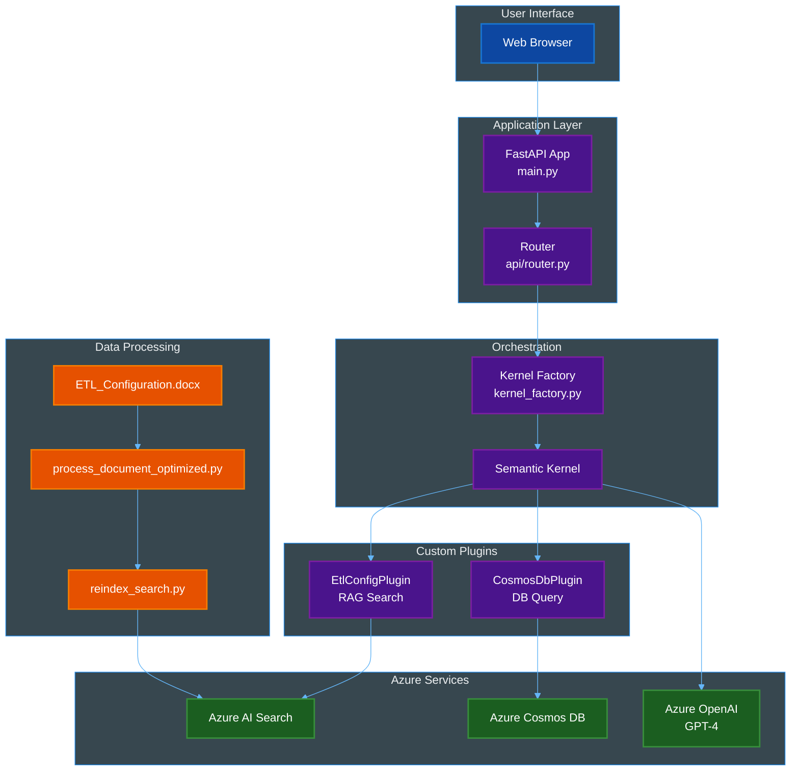
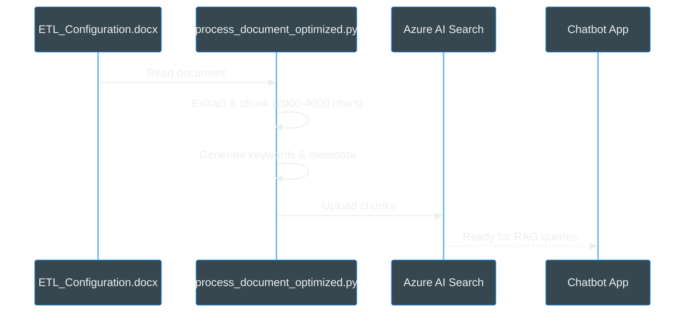
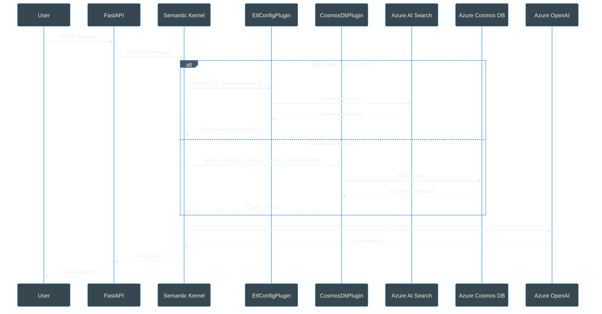

# ETL Assistant Chatbot - Architecture

## System Overview



### Component Descriptions

#### User Interface Layer
- **Web Browser**: The chat interface where users interact with ALMA by typing questions and receiving answers in real-time.

#### Application Layer
- **FastAPI App (main.py)**: The main web server that handles incoming requests and serves the frontend. It acts as the entry point for all user interactions.
- **Router (api/router.py)**: Routes incoming chat messages to the appropriate processing logic and manages conversation sessions for each user.

#### Orchestration Layer
- **Kernel Factory (kernel_factory.py)**: Sets up and configures all the components needed for the AI assistant to work. Think of it as the "startup configuration" for ALMA.
- **Semantic Kernel**: The brain coordinator that decides when to search documentation, query databases, or ask the AI for help based on what the user needs.

#### Custom Plugins (The "Tools")
- **EtlConfigPlugin (RAG Search)**: Searches through technical documentation to find relevant information and provide accurate answers. It's like having a smart document search assistant.
- **CosmosDbPlugin (DB Query)**: Retrieves existing ETL configurations from the database and can count how many configurations match specific criteria.

#### Azure Services (External Resources)
- **Azure OpenAI (GPT-4)**: The AI language model that understands questions, generates human-like responses, and combines information from multiple sources into coherent answers.
- **Azure Cosmos DB**: The database where all ETL configuration JSONs are stored. It's queried when users ask about existing configurations.
- **Azure AI Search**: A smart search engine that quickly finds relevant documentation chunks using semantic understanding, not just keyword matching.

#### Data Processing (Setup/Maintenance)
- **ETL_Configuration.docx**: The source Word document containing all technical documentation about ETL processes and configurations.
- **process_document_optimized.py**: A script that reads the Word document, breaks it into searchable chunks, and adds helpful metadata. Run once when documentation is updated.
- **reindex_search.py**: Takes the processed documentation chunks and uploads them to Azure AI Search, making them searchable by the chatbot.

## Data Flow

### 1. Document Processing Pipeline


### 2. Chat Interaction Flow


## Component Details

### Core Files
- **[app/main.py](../app/main.py)**: FastAPI application entry point
- **[app/api/router.py](../app/api/router.py)**: Chat endpoints & session management with ALMA personality
- **[app/core/kernel_factory.py](../app/core/kernel_factory.py)**: Semantic Kernel initialization

### Plugins

#### EtlConfigPlugin - RAG Documentation Search
- **Purpose**: Retrieval-Augmented Generation for ETL documentation
- **Location**: [app/plugins/EtlConfigPlugin/](../app/plugins/EtlConfigPlugin/)
- **Key Features**:
  - Semantic search using Azure AI Search
  - Semantic titles for improved relevance ranking
  - Input validation (blocks empty requests)
- **Main Function**: `search_etl_documentation(user_request: str)`

#### CosmosDbPlugin - Database Queries & Validations
- **Purpose**: Query Azure Cosmos DB configurations with pre-execution validations
- **Location**: [app/plugins/CosmosDbPlugin/](../app/plugins/CosmosDbPlugin/)
- **Key Features**:
  - Advanced SQL query support (filters, sorting, pagination)
  - **Application-side counting** via `count_configurations()` (Cosmos DB doesn't support COUNT/SUM/AVG)
  - **Pre-execution validations**:
    - Blocks unsupported aggregations (COUNT, SUM, AVG, GROUP BY)
    - Domain validation with fuzzy matching suggestions
    - Filter parameter validation
  - Domain-specific queries with `list_configurations_by_domain()`
- **Main Functions**:
  - `query_existing_config(sql_query: str)` - Execute SQL queries with validations
  - `count_configurations(filter: str)` - Count configurations (Python-side counting)
  - `list_configurations_by_domain(domain: str)` - List configs by domain with validation

### Data Processing
- **[data/process_document_optimized.py](../data/process_document_optimized.py)**: Main document processor with semantic title generation
- **[data/reindex_search.py](../data/reindex_search.py)**: Azure AI Search indexing with semantic configuration

## ALMA Personality

**ALMA** (Advanced Learning & Metadata Assistant) is the chatbot's branded identity with distinct personality traits:

- **Professional** with a youthful, fresh approach
- **Enthusiastic** and proactive in solving problems
- **Engaging** - guides users step-by-step with clear examples
- **Celebratory** when tackling challenges together
- **Entrepreneurial** - proposes innovative solutions

The ALMA personality is configured in the `SYSTEM_PROMPT` variable in [app/api/router.py](../app/api/router.py).

## Pre-Execution Validations

The application implements input validation **before** executing database/search operations to prevent errors and provide helpful guidance:

### HIGH PRIORITY Validations (Implemented)

1. **Validation A**: Block unsupported aggregations in queries
   - Prevents: `COUNT()`, `SUM()`, `AVG()`, `MIN()`, `MAX()`, `GROUP BY`
   - Location: `CosmosDbPlugin.query_existing_config()`
   - Action: Returns error with suggestion to use `count_configurations()`

2. **Validation E**: Block aggregations in count filter
   - Prevents: Aggregation functions in filter parameter
   - Location: `CosmosDbPlugin.count_configurations()`
   - Action: Returns error explaining automatic counting

3. **Validation H**: Domain validation with fuzzy matching
   - Validates: Domain names against 34 known domains
   - Location: `CosmosDbPlugin.list_configurations_by_domain()`
   - Action: Suggests similar domains using fuzzy matching

4. **Validation I**: Block empty search requests
   - Prevents: Empty or whitespace-only search queries
   - Location: `EtlConfigPlugin.search_etl_documentation()`
   - Action: Returns error with example questions

## Application-Side Counting

**Challenge**: Azure Cosmos DB SQL API does not support aggregation functions (COUNT, SUM, AVG, GROUP BY).

**Solution**: The `count_configurations()` function retrieves all matching documents and counts them in Python:

```python
# Executes SELECT query
results = await cosmos_service.query_configurations(query)

# Counts in Python
total_count = len(results)

# Extracts statistics automatically
unique_domains = set(doc.get('domain') for doc in results)
unique_layers = set(doc.get('layer') for doc in results)
```

This workaround enables counting functionality while respecting Cosmos DB limitations.

## Token Management

See [TOKEN_MANAGEMENT_SOLUTION.md](TOKEN_MANAGEMENT_SOLUTION.md) for details on:
- Chat history limitations (max 10 messages)
- Compact system prompts
- Dedicated endpoint for complete JSON examples

## Deployment

### Local Development
```bash
uvicorn app.main:app --reload --port 8000
```

### Azure Deployment
See main [README.md](../README.md) for Azure Container Apps deployment.